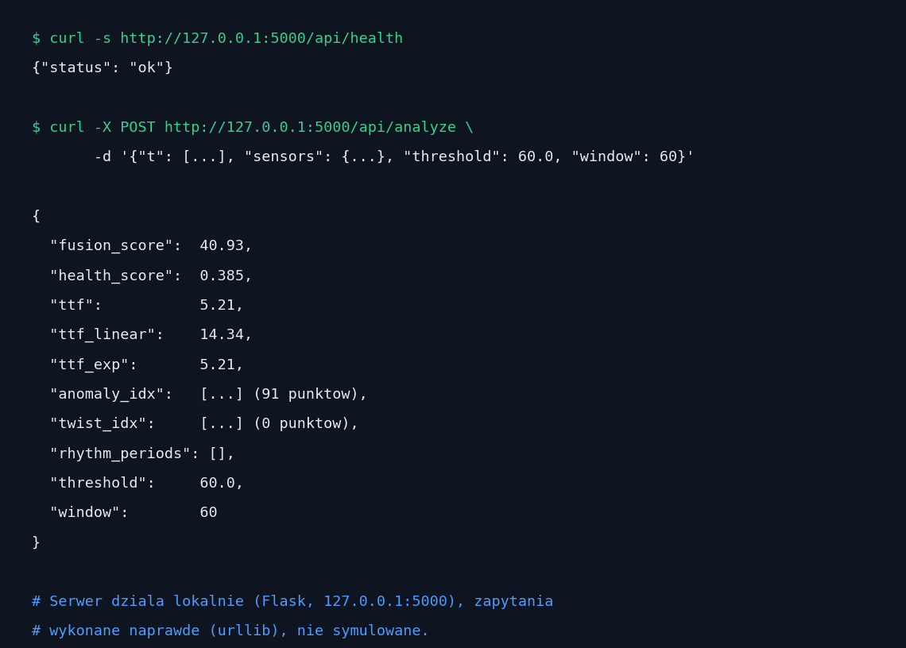
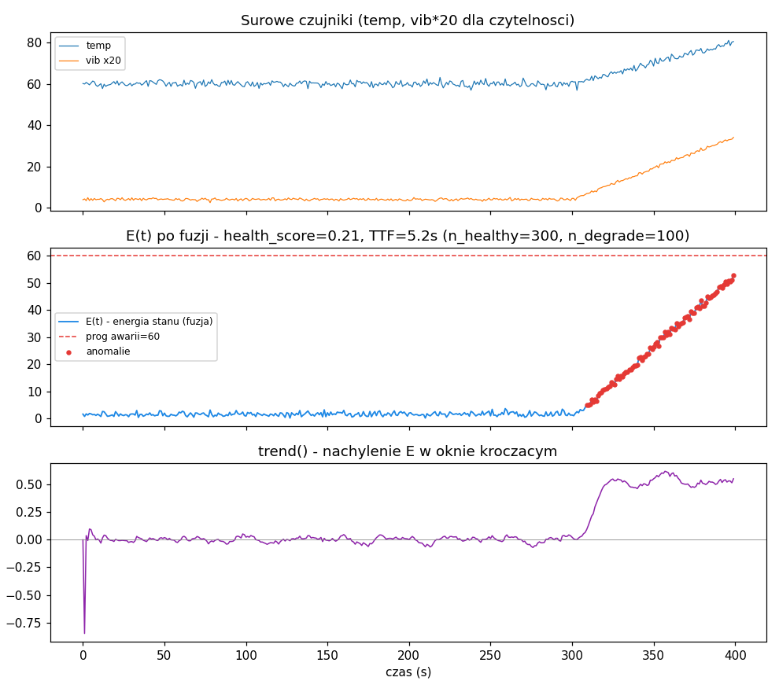

# TIMDR-Industrial-Predict

Predictive maintenance metodą TIMDR: fuzja wielu czujników maszyny w
jeden sygnał "energii stanu" E(t) (`timdr_industrial_fusion.py`), plus
predykcja czasu do awarii i health-score (`timdr_industrial_predict.py`),
plus lokalny dashboard z REST API (`api.py` + `static/dashboard.html`),
uruchamiany jednym kliknięciem przez `run.bat`.

> 📖 Pełna historia znalezionych błędów, przyczyn i poprawek (w tym
> testy na realnych danych) jest wydzielona do osobnego pliku:
> **[`HISTORIA_BLEDOW.md`](HISTORIA_BLEDOW.md)**. Ten plik opisuje
> wyłącznie, jak używać programu.

## 🔴 Program działa NA ŻYWO, na prawdziwej maszynie (`monitor.py`)

To nie tylko demo do przeglądania w przeglądarce — `monitor.py`
podłącza cały pipeline TIMDR (fuzja + health-score + TTF) do
**rosnącego pliku CSV z prawdziwego urządzenia** i pracuje w tle w
jednym z dwóch trybów:

- **Ciągły** — proces działa cały czas, sprawdza plik co `--interval`
  sekund (Ctrl+C kończy):
  ```
  python monitor.py --csv maszyna_live.csv --healthy-ref rozruch_zdrowy.csv --interval 5
  ```
- **Okresowy** — jedno sprawdzenie i wyjście, do wywołania z zewnętrznego
  harmonogramu (cron / Harmonogram zadań Windows / systemd timer):
  ```
  python monitor.py --csv maszyna_live.csv --once
  ```
  (po pierwszym uruchomieniu z `--healthy-ref` kalibracja jest zapisana
  do `timdr_calibration.json` i kolejne `--once` jej nie potrzebują —
  nie trzeba podawać referencji przy każdym wywołaniu).

**Kalibracja bez ręcznego wskazywania zdrowego okresu**: przy
przenoszeniu na nowy, nieznany silnik zamiast `--healthy-ref` można użyć
`--auto-calibrate` — automatycznie znajdzie najbardziej stabilne podokno
w już zebranych danych, zamiast zakładać, że pierwsze próbki są zdrowe:
```
python monitor.py --csv maszyna_live.csv --auto-calibrate --once
```

Każde sprawdzenie: wczytuje CAŁĄ historię z pliku CSV (nie tylko nowe
wiersze), liczy health-score i unormowany TTF, drukuje jedną linię
statusu i zapisuje pełny stan do `timdr_status.json` (health, TTF,
`confirmed`, `alert`) — stąd może to odebrać dashboard (patrz niżej)
albo własny system alarmowania, bez zmiany tego skryptu. Dodatkowo, przy
samej kalibracji, zapisuje RAZ diagnostykę do
`timdr_calibration_report.json`: ile próbek teoretycznie potrzeba do
stabilizacji statystyk (`calibration_convergence()`) oraz czy wybrane
okno faktycznie jest stabilne wg testu Manna-Kendalla
(`validate_window()`) — patrz sekcja dashboardu niżej, gdzie to widać.

Zweryfikowano end-to-end na realnych danych NASA C-MAPSS (dwa niezależne
silniki turbowentylatorowe) oraz na realnym protokole OBD-II
(`obd_source.py` — most z prawdziwego adaptera ELM327/python-obd do
formatu CSV, testowany wobec niezależnego emulatora protokołu, gotowy
do użycia z prawdziwym autem bez zmian w kodzie).

### Podłączenie realnego OBD-II (samochód/silnik)

```
python obd_source.py --port /dev/ttyUSB0 --csv silnik_live.csv --interval 1
python monitor.py --csv silnik_live.csv --auto-calibrate --interval 5
```

`--port` to prawdziwy port szeregowy adaptera ELM327 (USB/Bluetooth) —
`COM5` na Windows, `/dev/ttyUSB0` na Linuksie. `--list-supported` pokaże,
jakie PID-y faktycznie oferuje dany adapter/pojazd.

## 🖥️ Dashboard + API



Uruchomienie: `run.bat` (Windows, instaluje zależności i otwiera
przeglądarkę) albo ręcznie `python api.py` + wejście na
`http://127.0.0.1:5000`. Wszystko działa lokalnie — żadne dane nie
opuszczają komputera.

- **Karty stanu**: health-score (z paskiem, kolor zależny od progu
  0.3/0.6), time-to-failure, fusion-score, liczba anomalii/twistów,
  wykryty rytm.
- **Wykres E(t)** z linią progu awarii i zaznaczonymi anomaliami/twistami.
- **Wykres trendu** (nachylenie E w oknie kroczącym).
- **Wykresy surowych czujników** (siatka, po jednym na czujnik).
- **Wybór scenariusza demo** (dropdown) — 5 syntetycznych awarii + 2
  realne silniki NASA C-MAPSS (patrz sekcja niżej), próg `threshold`
  ustawia się automatycznie na wartość sugerowaną dla wybranego
  scenariusza.
- **📄 Wczytaj CSV** — podłączenie własnych danych (nie tylko demo):
  plik z nagłówkiem, kolumna czasu (domyślnie `t`, konfigurowalna w
  polu obok przycisku) + dowolna liczba kolumn numerycznych jako
  czujniki. Bez kolumny czasu o podanej nazwie używany jest indeks
  wiersza.
- **📡 Panel monitoringu na żywo** — jeśli w tle działa `monitor.py`,
  dashboard pokazuje na bieżąco (odświeżanie co 5s) jego wynik: liczbę
  próbek, health, TTF i alarm. Panel jest niewidoczny, jeśli
  `monitor.py` nie jest uruchomiony. Dodatkowo, w trybie ciągłym
  (`--interval`), panel pokazuje 🟢 live / 🔴 offline — to ROZRÓŻNIENIE,
  nie to samo co "czy monitor.py działa": `monitor.py` może grzecznie
  odpytywać ten sam, już nierosnący plik CSV co `--interval` sekund
  (np. gdy adapter OBD-II się rozłączył), a badge poprawnie pokaże
  🔴 offline mimo że sam proces monitorujący wciąż żyje — zweryfikowane
  wprost: symulacja rosnącego, potem zatrzymanego, potem znów rosnącego
  pliku CSV poprawnie przełącza badge live→offline→live.
- **🧪 Panel diagnostyki kalibracji** — jednorazowa informacja z
  MOMENTU kalibracji (nie odświeża się co 5s, żeby nie zaszumiać
  widoku): jaką metodą skalibrowano, ile próbek do stabilizacji wg
  `calibration_convergence()`, i czy wybrane okno przeszło walidację
  Manna-Kendalla.
- Analiza uruchamia się **automatycznie** po wybraniu scenariusza,
  wczytaniu CSV, albo zmianie `threshold`/`window` — nie trzeba osobnego
  przycisku "uruchom analizę"; pole obok pól liczbowych pokazuje
  "⏳ analizowanie…" / "✓ przeanalizowano HH:MM:SS".

## 🎲 Scenariusze demo (`demo_scenarios.py`)

5 syntetycznych awarii odpowiadających typowym trybom uszkodzeń, każdy
zweryfikowany empirycznie, że faktycznie uruchamia deklarowany detektor
(`test_demo_scenarios.py`), plus 2 REALNE silniki z NASA C-MAPSS:

| Scenariusz | Pokazuje | Czujniki |
|---|---|---|
| `bearing_wear` | trend + TTF w przód | temp, vib, pressure, current |
| `pump_seizure` | nagły twist/anomalia + trend po zdarzeniu | temp, vib, pressure, current |
| `uneven_motor_rotation` | rytm (okres 12) + odosobnione skoki | current, vibration |
| `resonance_loose_parts` | rytm (okres 20) + twist na każdym uderzeniu | temp, vib, pressure, current |
| `duty_cycle_problems` | rytm (okres 30) + anomalia + trend w drugiej połowie | current, pressure |
| `real_engine_1_full` | 🛩️ REALNE dane — pełny przebieg run-to-failure, 192 cykle | 10 czujników C-MAPSS |
| `real_engine_2_live` | 🛩️ REALNE dane — pierwsze 85 cykli, silnik wciąż zdrowy (live) | 10 czujników C-MAPSS |

Uwagi dotyczące projektowania własnych scenariuszy/czujników (znalezione
nieoczywiste właściwości metody median/MAD) — patrz `HISTORIA_BLEDOW.md`.

## 📊 Realne dane silników (`data/real_engines/`)

Dwa prawdziwe silniki NASA C-MAPSS FD001 leżą w repo gotowe do użycia —
zarówno przez dashboard (jako demo, patrz wyżej), jak i bezpośrednio
przez `monitor.py`:

```
python monitor.py --csv data/real_engines/cmapss_unit1_live_192cycles.csv --auto-calibrate --once
python monitor.py --csv data/real_engines/cmapss_unit2_live_85cycles.csv --auto-calibrate --once
```

Silnik 1 ma pełny przebieg do awarii; silnik 2 to tylko pierwsze 85
cykli (celowa symulacja "danych na żywo" — jeszcze nie wiadomo, czy/kiedy
dojdzie do awarii). Pochodzenie danych i pełne wyjaśnienie ograniczenia
silnika 2: `data/real_engines/README.md`.

## Endpointy API

| Endpoint | Metoda | Opis |
|---|---|---|
| `/` | GET | dashboard (HTML) |
| `/api/health` | GET | healthcheck samego API |
| `/api/scenarios` | GET | lista scenariuszy demo (nazwa, opis, sugerowany próg) |
| `/api/demo` | GET | zestaw czujników demo (`?scenario=<nazwa>`, domyślnie `bearing_wear`) |
| `/api/analyze` | POST | pełna analiza: `{t, sensors, threshold, window}` → JSON z E(t), twist/trend/anomalie/rytm, TTF, health_score |
| `/api/monitor/status` | GET | ostatni stan zapisany przez `monitor.py` (do panelu live) |
| `/api/monitor/calibration` | GET | raport z momentu kalibracji (Mann-Kendall + ile próbek do stabilizacji) |

`/api/analyze` przyjmuje czujniki o **różnej długości** i zwraca
czytelny błąd (HTTP 400 + opis) zamiast 500 przy brakujących/pustych
danych.

## 📦 Nowe repo?

Tak — to osobna domena (predictive maintenance dla maszyn przemysłowych:
łożyska, pompy, silniki, wibracje/temperatura/ciśnienie/prąd), odrębna
od istniejących repozytoriów (Radar, Flight-Tracking, Security,
Echosonda, Earthquake). Oba moduły (`Fusion` + `Predict`) trzymane razem
w jednym repo, bo `Predict` bezpośrednio zależy od wyjścia `Fusion`
(energii stanu E(t)) i zawsze są używane razem, jak pokazuje przykład
użycia poniżej.

## Przykład użycia

```python
from timdr_industrial_fusion import TIMDRIndustrialFusion
from timdr_industrial_predict import TIMDRIndustrialPredict

fusion = TIMDRIndustrialFusion()
predict = TIMDRIndustrialPredict()

E, Z = fusion.fuse(t, [temperature_signal, vibration_signal, pressure_signal, current_signal])

tw_idx, tw_z = fusion.twist(t, E)
tr_sl, tr_z = fusion.trend(t, E)
an_idx, an_z = fusion.anomalies(E)
periods, r_score = fusion.rhythm(E)
score = fusion.fusion_score(tw_z, tr_z, an_z, r_score)

ttf, ttf_lin, ttf_exp = predict.predict_failure(t, E, threshold=60.0)
health = predict.health_score(E, threshold=60.0)
```



## 🎯 Zastosowania i warunki

- **Zużycie łożysk / zatarcie pompy / nierówne obroty**: `trend` na
  powolną degradację, `twist` na pierwsze "uderzenia", `anomalies` na
  skoki, `rhythm` na prawdziwe cykliczne wzorce, nie na sam trend.
- **`threshold` musi być spójny między `predict_failure()` i
  `health_score()`** — oba teraz go współdzielą, ale to WY wybieracie
  wartość odpowiednią dla Waszej maszyny (E to znormalizowana,
  bezwymiarowa "odległość od normy", nie fizyczna jednostka).
- **`window` w `predict_failure()`/`degradation_model()` (domyślnie 60)
  musi pasować do dynamiki Waszej maszyny i częstotliwości próbkowania**
  — za krótkie okno = wrażliwość na szum, za długie = rozwodniony TTF
  przez starą historię.
- **Model wykładniczy jest bardziej pesymistyczny niż liniowy** przy
  typowych profilach degradacji — `predict_failure()` domyślnie bierze
  bardziej pesymistyczny z obu (`min()`), nie "bardziej stabilny" —
  ostrzega wcześniej kosztem większej liczby fałszywych alarmów. Jeśli
  wolisz mniej czułe ostrzeżenia, użyj `ttf_linear` bezpośrednio
  zamiast `ttf`.
- **Przy uruchomieniu na nowym urządzeniu** użyj `--auto-calibrate`
  zamiast ręcznie wskazywać zdrowy okres — i sprawdź panel diagnostyki
  kalibracji w dashboardzie (albo `timdr_calibration_report.json`), żeby
  wiedzieć, czy wybrane okno faktycznie przeszło walidację statystyczną.
- Metoda nie jest przyczynowa (`np.gradient` w punktach wewnętrznych) —
  do strumienia na żywo nadaje się z jednopróbkowym opóźnieniem.

Uruchomienie: `python demo.py` / testy: `pytest -q` (61/61, szczegóły
błędów znalezionych po drodze: [`HISTORIA_BLEDOW.md`](HISTORIA_BLEDOW.md)).
